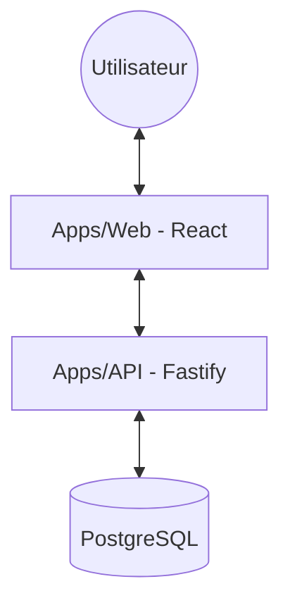

# Architecture Globale

MailerPro est conçu comme un monorepo moderne permettant une grande vélocité de développement.

## Diagramme de haut niveau



## Technologies Clés

| Couche | Technologie |
| :--- | :--- |
| **Frontend** | React 19, Axios, TanStack Query |
| **Backend** | Fastify 5, Zod/Ajv |
| **Database** | Prisma ORM, PostgreSQL |
| **Style** | CSS Modules, Lucide React |
| **Monorepo** | Turborepo, NPM Workspaces |

```
