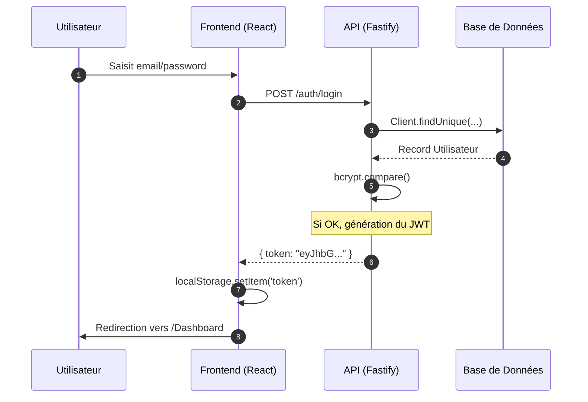
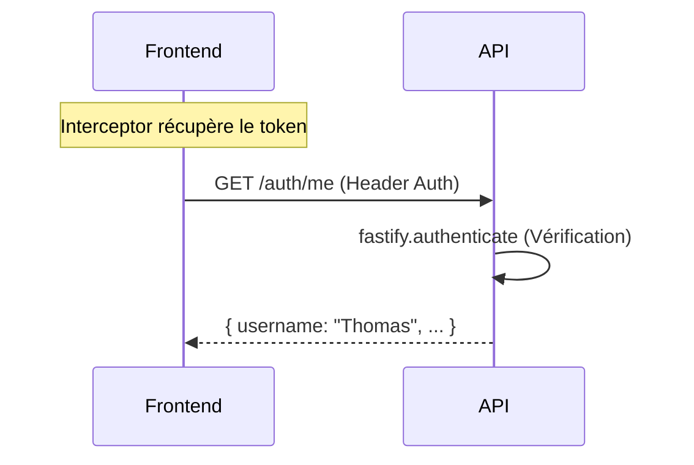

# Flux d'Authentification

Le système d'authentification repose sur des **JSON Web Tokens (JWT)**.

## Diagramme de Séquence Login

Voici comment se déroule une connexion sécurisée entre le client et le serveur :

## Persistance et Interception
Toutes les requêtes suivantes vers l'API sont interceptées par **Axios** pour inclure le header `Authorization: Bearer <token>`.

