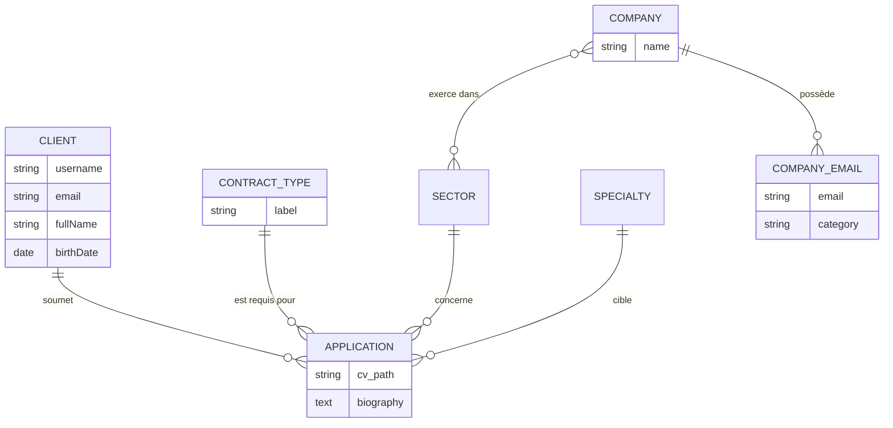
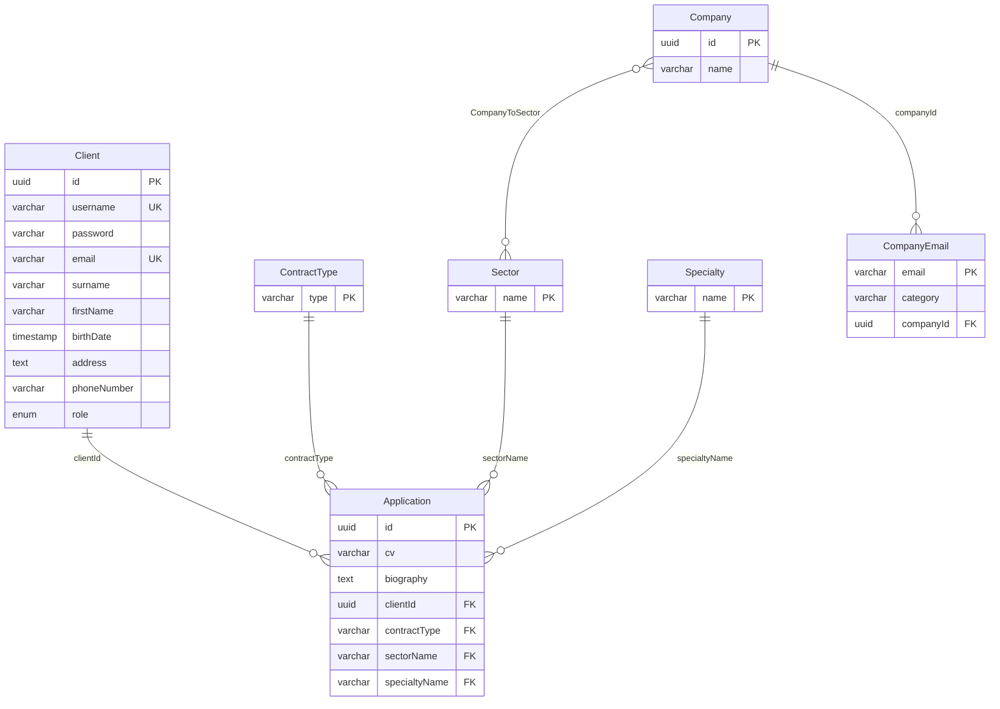

# Modélisation de la Base de Données

Pour bien comprendre la structure des données de MailerPro, nous distinguons le modèle conceptuel (Entité-Association) de l'implémentation physique (Schéma Relationnel).

## 1. Diagramme Entité-Association (MCD)

Ce diagramme se concentre sur les concepts métier et les relations logiques, sans s'occuper des contraintes techniques de clé étrangère.

## 2. Schéma Relationnel (MLD/MPD)

Ce schéma représente l'implémentation réelle dans **PostgreSQL** via Prisma. Il inclut les types de données, les clés primaires (PK) et les clés étrangères (FK).

## Description des Tables

### Client

Stocke les informations de profil et d'authentification des utilisateurs. Le champ `role` permet de distinguer les candidats des administrateurs.

### Application

C'est la table centrale du recrutement. Elle contient les documents (CV) et les préférences de poste de l'utilisateur.

### Annuaire Entreprises (Company & CompanyEmail)

Structure permettant de cibler les envois d'e-mails. Une entreprise peut avoir plusieurs adresses e-mail segmentées par catégories (RH, Technique, etc.).
