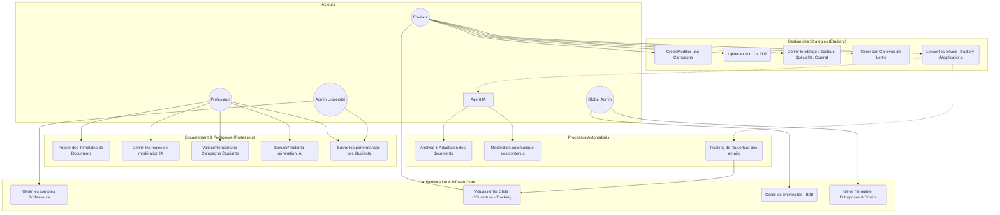

# Diagramme des Cas d'Usage (DCU)

Ce diagramme décrit les interactions entre les différents acteurs du système et les fonctionnalités proposées par MailerPro.

## Acteurs du Système

- **Étudiant** : Cherche à automatiser ses candidatures et générer ses documents.
- **Professeur** : Accompagne les étudiants et configure l'intelligence artificielle.
- **Admin Université** : Gère les comptes de son établissement.
- **Global Admin** : Supervise l'ensemble de la plateforme SaaS.

## Diagramme Mermaid (DCU)

## Détails des Cas d'Usage

### Étudiant (Candidat)
*   **Gérer ses Stratégies** : L'étudiant ne gère pas des envois isolés mais des campagnes cohérentes (ex: "Stage Big Data - Secteur Finance").
*   **Adaptation IA** : Il fournit un CV et une lettre de base que l'IA adaptera à chaque entreprise.

### Professeur (Mentor)
*   **Modération** : Il a un droit de regard sur les campagnes avant qu'elles ne soient lancées pour garantir la réputation de l'école.
*   **Simulation** : Avant de valider une règle de modération IA, il peut prévisualiser ce que l'IA générera pour un étudiant type.

### Administrateur (Université & Global)
*   **Multi-Tenancy** : L'Admin Université gère son périmètre. L'Admin Global assure la maintenance de l'annuaire partagé des entreprises.
*   **Tracking Industriel** : Utilisation de pixels invisibles pour détecter les ouvertures et calculer le ROI des campagnes.

## Focus sur les fonctionnalités clés

### Simulation IA (Preview)
Le professeur peut sélectionner une entreprise de l'annuaire et tester le moteur d'IA pour voir comment une lettre de motivation standard d'un étudiant serait transformée. Cela permet d'ajuster le **Système de Modération** avant que les étudiants ne lancent de réelles campagnes.

### Automatisation B2B
Contrairement aux outils B2C, chaque envoi est tracé. L'université reçoit des statistiques réelles sur le taux d'ouverture des emails envoyés par ses étudiants, ce qui permet de mesurer l'employabilité de chaque promotion en temps réel.
